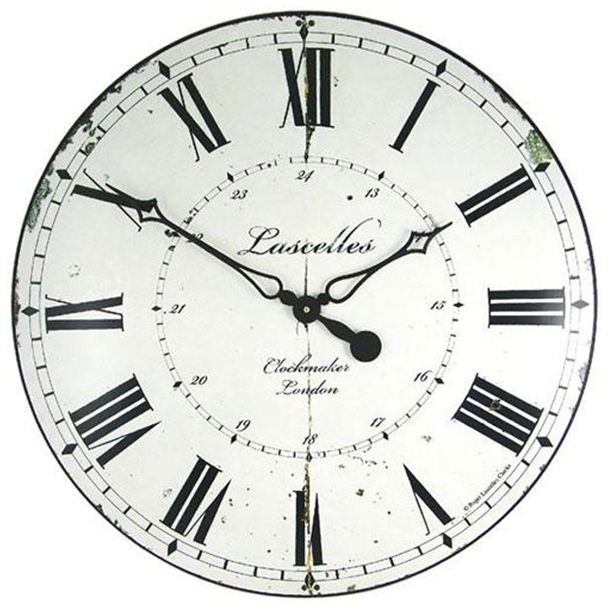
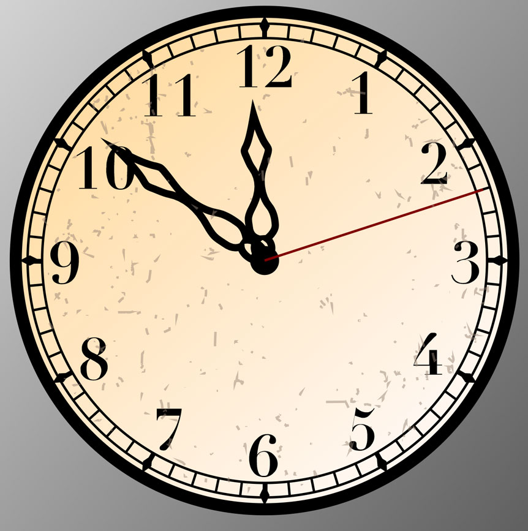

# Codepen-Connect Clock
React/GSAP Clock:
A pen to announce a codepen meetup "codepen-connect" integrating GSAP with react 16 to animate a clock.

## Feature-set

|<h3>Feature</h3>|<h3>Notes</h3>|<h3>Status</h3>|
|:-----------|:-------|:-------|
|**React**|16.0.0|***√***|
|**Normalization**|normalize.css|***√***|
|**Tooling**|Webpack|***√***|
|**babel-core**|env,react|***√***|
|**Animations**|CSS & SVG|***√***|
|**A scrolling library**|skroller|***pending***|
|**Distressed clockface**|illustrator|***pending***|

-----------------
## Ambitions for this project:

+ Proper integration of the greensock library into a react application.
+ A new take on a very conventional coding exercise. I wanted to communticate a particular message using animation and audio.
+ I will need to use skrollr or some other library to complete this project.

-----------------
# Notes, Context

The purpose is the coding exercise, of course, but the larger purpose is to announce a meetup that I plan to start in my area.

## Highlights
-----------------
### seconds-tics, numbers and hours-marks (diamons) pop from the face and tumble

As seconds hand ticks away, it "picks" them off the clock and tumble out of view.

Upon scrolling down, tick-tock volume lowers and a pile of pieces are revealed with a rubber ducky staring at you asking a question: "How long are you going to wait to learn what you want to learn?"

As the falling seconds hit him on the head.

Finally... "Join us" at codepen connect.

I opted for this:

## The above is a combination of the following

-----------------
## CLI commands

+ yarn run start

-----------------

# What I would do differently:

## Development process reflections & issues:

1.

2. 

3.

